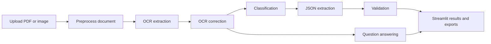
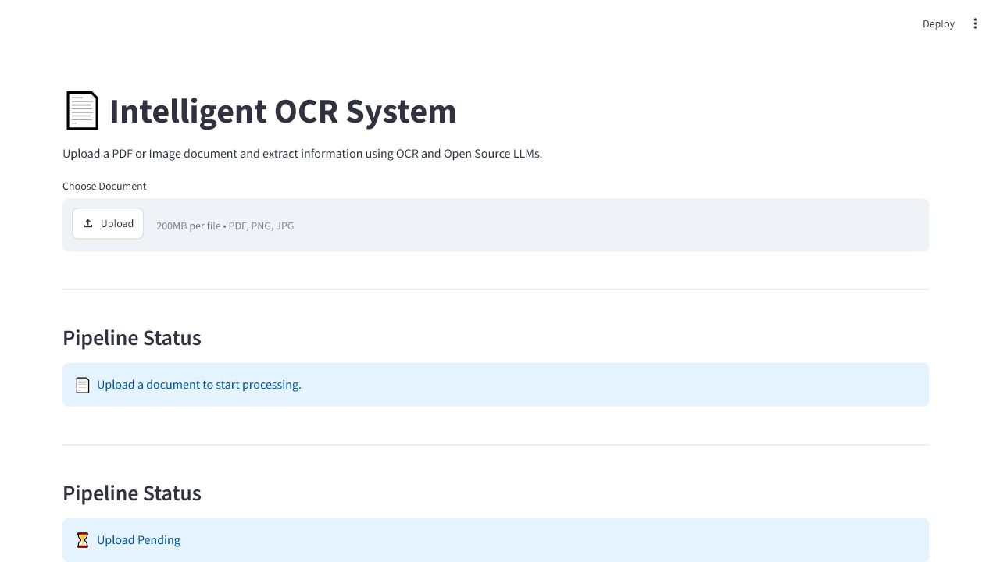
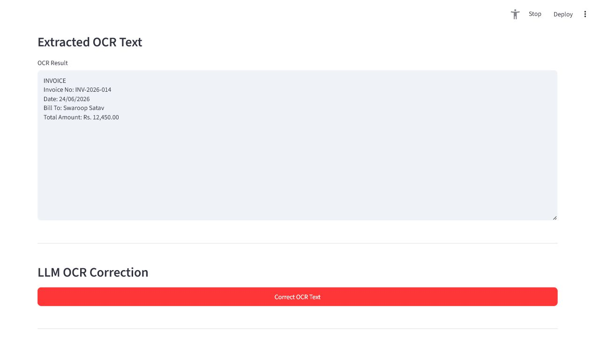
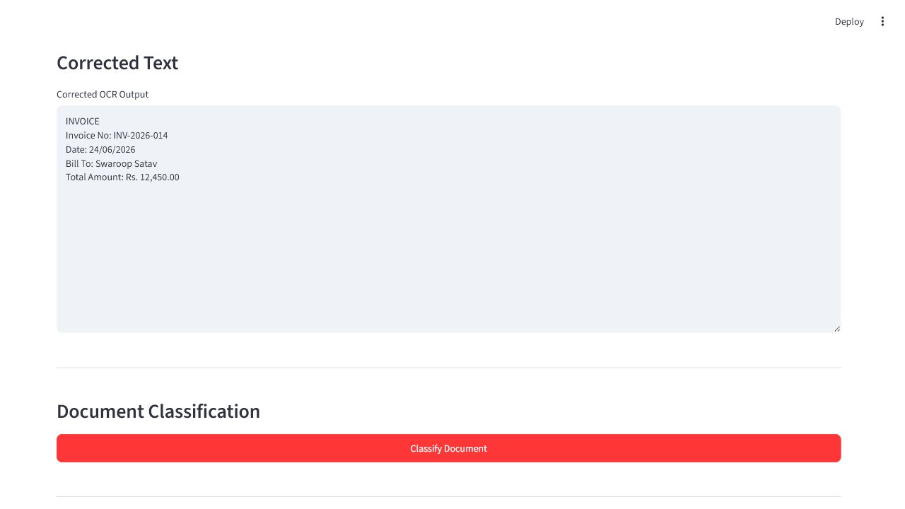
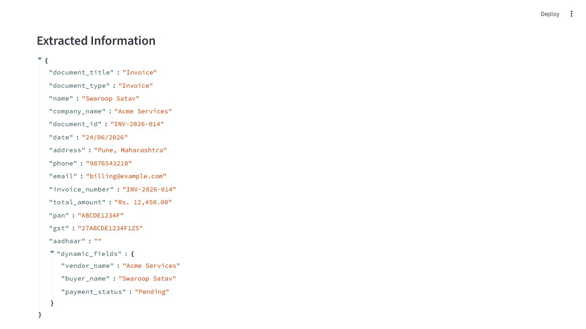
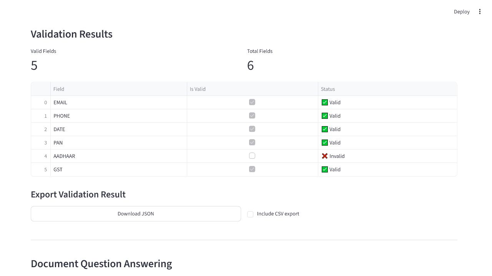
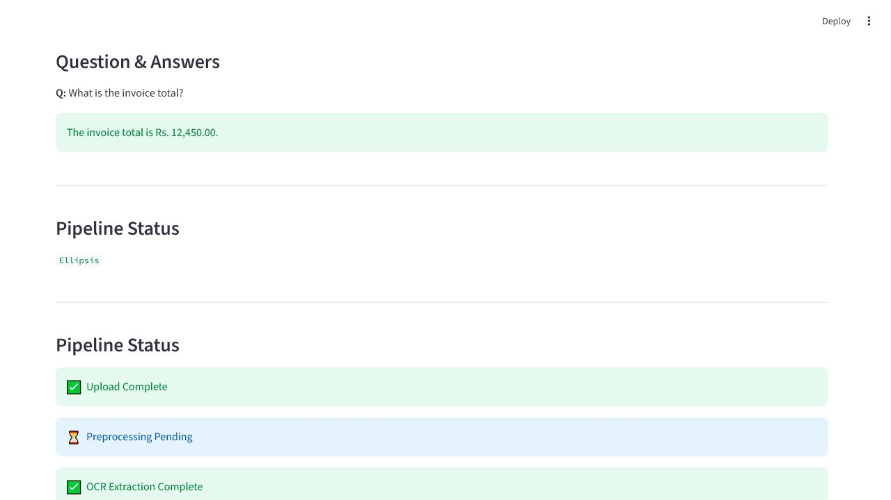

# Intelligent OCR System

Intelligent OCR System is a FastAPI and Streamlit application for extracting
structured information from PDF and image documents. It supports document
upload, PDF-to-image preprocessing, OCR, LLM-based OCR correction,
classification, JSON extraction, field validation, and document Q&A.

## Features

- Upload PDF, PNG, JPG, or JPEG documents.
- Convert PDF pages to images and apply preprocessing.
- Extract English text with EasyOCR.
- Return OCR confidence, bounding boxes, and detected table-like rows.
- Correct OCR text with a local Hugging Face language model.
- Classify document type with LLM output plus heuristic confidence safeguards.
- Extract structured JSON with standard and document-specific fields.
- Validate email, phone, date, PAN, Aadhaar, GST, amount, and selected
  document-specific values.
- Ask questions against the corrected document text.
- Export extracted and validated data as JSON, with optional CSV export.

## Architecture



## Project Structure

```text
backend/
  api/             FastAPI app and route modules
  config/          Environment and runtime settings
  models/          Qwen model loader
  services/        Upload, PDF, image, OCR, LLM, extraction, validation services
  static/          Static backend assets
frontend/
  app.py           Streamlit UI
  services/        Frontend API client
tests/             Backend, service, and API-client tests
docs/screenshots/ Demo screenshots
docs/technical-report.md
samples/            Sample input documents for review
```

Runtime folders such as `data/uploads`, `data/processed`, `data/cache`,
`outputs`, `.runtime`, and Python cache folders are ignored by Git.

## Installation

Use Python 3.13 or a compatible Python 3 version with the required binary
packages available for your platform.

1. Clone or open the project:

```powershell
cd C:\Users\Admin\PycharmProjects\Intelligent-OCR
```

2. Create and activate a virtual environment:

```powershell
python -m venv venv
.\venv\Scripts\Activate.ps1
```

3. Install dependencies:

```powershell
python -m pip install --upgrade pip
pip install -r requirements.txt
```

The first OCR or model run can download model files and may take time,
depending on network speed and hardware.

EasyOCR, PyTorch, Transformers, OpenCV, FastAPI, and Streamlit are installed
from `requirements.txt`.

## Environment Setup

Create a local `.env` file from the example:

```powershell
Copy-Item .env.example .env
```

Recommended starting values:

```env
HF_TOKEN=
BASE_URL=http://127.0.0.1:8000
BACKEND_CONNECT_TIMEOUT_SECONDS=10
BACKEND_REQUEST_TIMEOUT_SECONDS=120
BACKEND_LONG_REQUEST_TIMEOUT_SECONDS=900
MODEL_NAME=Qwen/Qwen2.5-1.5B-Instruct
PDF_RENDER_SCALE=1.5
ENABLE_BLUR=false
ENABLE_THRESHOLD=true
ENABLE_DESKEW=true
ENABLE_ENHANCEMENT=true
OCR_CACHE_ENABLED=true
OCR_LANGUAGES=en
HF_LOCAL_FILES_ONLY=false
```

Important variables:

- `HF_TOKEN`: optional Hugging Face token for gated/private model access.
- `BASE_URL`: FastAPI backend URL used by the Streamlit frontend.
- `BACKEND_CONNECT_TIMEOUT_SECONDS`: how long the frontend waits to connect
  to the backend.
- `BACKEND_REQUEST_TIMEOUT_SECONDS`: default frontend read timeout for quick
  backend requests.
- `BACKEND_LONG_REQUEST_TIMEOUT_SECONDS`: frontend read timeout for
  preprocessing, OCR, correction, classification, extraction, and Q&A. Increase
  this on CPU-only systems or first runs that download/load model files.
- `MODEL_NAME`: Hugging Face model used for correction, classification,
  extraction, and Q&A.
- `PDF_RENDER_SCALE`: controls PDF page render resolution before preprocessing.
- `ENABLE_BLUR`, `ENABLE_THRESHOLD`, `ENABLE_DESKEW`, `ENABLE_ENHANCEMENT`:
  enable or disable preprocessing steps.
- `OCR_CACHE_ENABLED`: caches OCR responses under `data/cache`.
- `OCR_LANGUAGES`: comma-separated EasyOCR language codes. Keep `en` for
  faster English-only OCR, or use values such as `en,hi` when multilingual
  OCR is required and the language model files are available.
- `HF_LOCAL_FILES_ONLY`: set to `true` for offline demos after Hugging Face
  model files are already cached locally.

The upload directory is currently configured in
`backend/config/settings.py` as `data/uploads`. Processed images are currently
written by the PDF and image services to `data/processed`.

Do not commit `.env`; it may contain private tokens.

## Run Backend

Start the FastAPI backend from the project root:

```powershell
.\venv\Scripts\python -m uvicorn backend.api.app:app --host 127.0.0.1 --port 8000 --reload
```

Health check:

```powershell
Invoke-WebRequest http://127.0.0.1:8000/
```

Expected response:

```json
{
  "status": "running",
  "service": "OCR Backend"
}
```

## Run Frontend

In a second terminal, start Streamlit from the project root:

```powershell
.\venv\Scripts\streamlit run frontend\app.py --server.address 127.0.0.1 --server.port 8501
```

Open:

```text
http://127.0.0.1:8501
```

The frontend API client targets `BASE_URL` from `.env`, defaulting to
`http://127.0.0.1:8000`.

## Docker

Build and run both backend and frontend with Docker Compose:

```powershell
docker compose up --build
```

Backend: `http://127.0.0.1:8000`

Frontend: `http://127.0.0.1:8501`

The compose file mounts `./data` so uploads, processed images, and OCR caches
survive container restarts.

## Sample Workflow

1. Open the Streamlit frontend.
2. Upload a PDF, PNG, JPG, or JPEG document.
3. Click `Upload Document`.
4. Click `Run Preprocessing`.
5. Click `Run OCR`.
6. Review the extracted OCR text.
7. Click `Correct OCR Text`.
8. Click `Classify Document`.
9. Click `Extract Information`.
10. Review the extracted JSON and key fields.
11. Click `Validate Data`.
12. Enter a document question, such as `What is the invoice total?`.
13. Click `Get Answer`.
14. Download JSON or enable CSV export where needed.

For documentation screenshots, the frontend also supports:

```text
http://127.0.0.1:8501/?demo=screenshots
```

This loads a static demo state without running the full backend pipeline.

## Sample Inputs

Use the synthetic sample invoice at:

```text
samples/demo_invoice.pdf
```

Additional synthetic review samples are also provided:

```text
samples/sample_receipt.pdf
samples/sample_resume.pdf
samples/sample_identity_card.pdf
samples/sample_bank_statement.pdf
samples/sample_multilingual_invoice.pdf
samples/sample_receipt_scanned.png
samples/sample_bank_statement_photo.png
samples/sample_identity_card_photo.png
```

These are intended for submission review and basic upload/preprocessing/OCR
checks without exposing private documents.

## Testing

Run the automated test suite:

```powershell
.\venv\Scripts\python -m pytest --basetemp=pytest-tmp -p no:cacheprovider
```

Current suite coverage includes upload validation, API route smoke tests,
validation logic, extraction parsing, frontend API-client error mapping,
classification fallback logic, OCR bounding-box/table-row metadata, real sample
PDF preprocessing, OCR failure handling, and model-loading failure handling.

## Screenshots

The screenshots below show representative pipeline states from the Streamlit UI.

### Upload Screen



### OCR Output



### Corrected Text



### Extracted JSON



### Validation Result



### Q&A Response



Additional end-to-end demo screenshots are available in `docs/screenshots/`
with the `e2e-` prefix.

## Technical Report

The short technical report requested in the assignment is available at
`docs/technical-report.md`, with a PDF copy at `docs/technical-report.pdf`.
It covers the OCR workflow, LLM integration, information extraction approach,
validation logic, challenges, and limitations.

## Performance Notes

- Recommended for local LLM inference: 16 GB RAM minimum, 32 GB preferred.
- GPU acceleration is recommended for faster Qwen inference. CPU-only systems
  can work, but correction, extraction, classification, and Q&A may take
  several minutes per document.
- EasyOCR first run may download OCR model files and can take longer than
  later cached runs.
- If network access is restricted, cache the Hugging Face model first and set
  `HF_LOCAL_FILES_ONLY=true` for the demo.
- Multi-page PDFs, high render scale, and multilingual OCR increase memory and
  processing time.
- For a smoother demo, run the backend first and wait for the OCR/LLM model
  startup before presenting the Streamlit UI.
- Live benchmark notes from the local verification run are stored in
  `docs/benchmark-notes.json`.
- Docker availability check details are stored in `docs/docker-check.md`.

## Limitations

- The default LLM model can be slow on CPU-only machines. During local demo
  testing, upload, preprocessing, and OCR completed successfully, while
  model-backed classification/extraction/Q&A could exceed several minutes.
- The first model run may require downloading large files from Hugging Face.
- OCR is configured for English text.
- OCR quality depends on scan clarity, orientation, noise, and document layout.
- Validation rules are focused on common Indian formats for phone, PAN,
  Aadhaar, GST, dates, amounts, and selected dynamic fields; international
  formats may be rejected.
- Missing optional fields are skipped instead of marked invalid. Provided
  values are still validated and marked true or false.
- Extraction depends on the LLM returning valid JSON. The backend defensively
  extracts the first JSON object, but malformed model output can still reduce
  accuracy.
- `dynamic_fields` are partially validated for known amount, date, balance, and
  account-number style keys; arbitrary dynamic fields are passed through.
- Uploaded documents and generated images are runtime artifacts and are not
  intended to be committed.

## Submission Notes

- Keep `.env`, `venv/`, `.idea/`, Python caches, uploaded files, processed
  images, OCR caches, and runtime logs out of version control.
- Use `.env.example` for shareable configuration.
- Include only intentional screenshots or synthetic sample assets in the repo.

